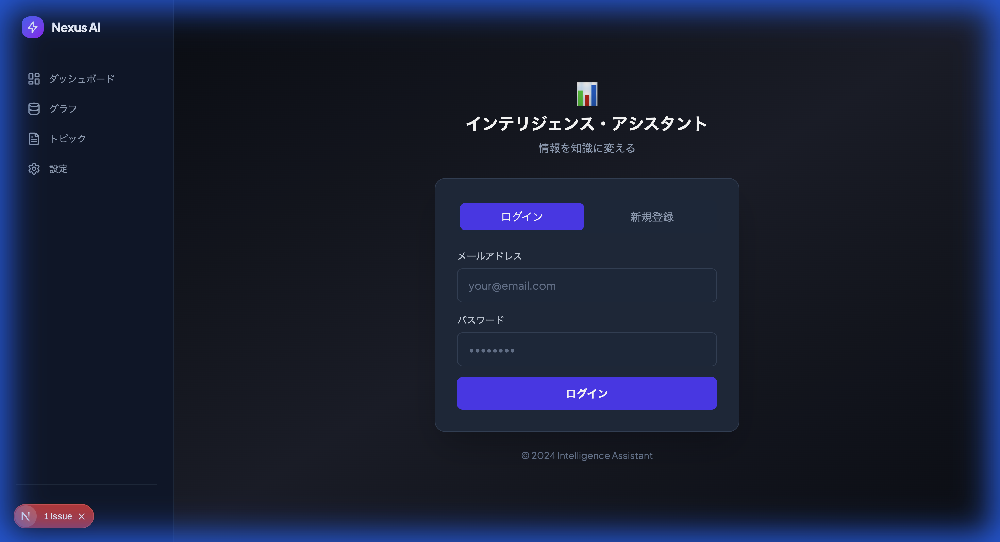

# 認証機能修正 ウォークスルー

## Phase 1: クライアント側認証 ✅ 完了

### 実装内容

1. **ProtectedRouteコンポーネント** - 保護されたページをラップし、未認証時は`/login`へリダイレクト
2. **AuthProvider強化** - `signOut`関数を追加
3. **ダッシュボード** - ユーザー名表示とログアウトボタンを追加
4. **グラフページ** - ProtectedRouteでラップ

### 動作確認結果

| テスト項目 | 結果 |
|----------|------|
| 未認証で`/`にアクセス | `/login`にリダイレクト ✅ |
| ログイン後ダッシュボード表示 | 成功 ✅ |
| ユーザー名表示 | メールアドレスから取得（testさん） ✅ |
| ログアウトボタン表示 | 表示される ✅ |

### スクリーンショット

#### ログインページ

#### ログイン後のダッシュボード

---

## Phase 2: API認証対応（次のステップ）

- [ ] getServerUser.ts作成（サーバー側ユーザー取得）
- [ ] 全APIにuser_id認証追加

## 変更されたファイル

| ファイル | 変更内容 |
|---------|---------|
| `src/components/ProtectedRoute.tsx` | 新規作成 - 認証チェック用ラッパー |
| `src/components/AuthProvider.tsx` | signOut関数追加 |
| `src/app/page.tsx` | ProtectedRouteでラップ、ユーザー名・ログアウトボタン追加 |
| `src/app/graph/page.tsx` | ProtectedRouteでラップ |
| `src/middleware.ts` | 認証チェック無効化（クライアント側で処理） |
